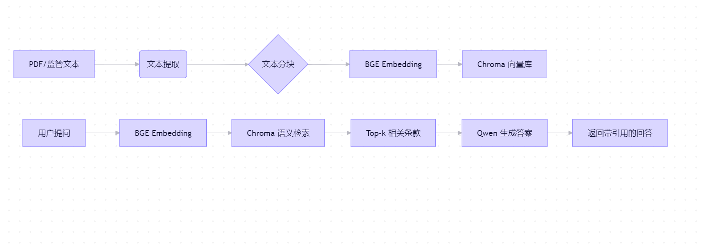

## 系统架构
```text
┌───────────────────────────────────────────────────────────────┐
│                  用户交互层                                   │
│  ┌─────────────┐     ┌──────────────┐     ┌──────────────┐   │
│  │  上传 PDF   │────▶│  提问：       │────▶│  查看答案 +  │   │
│  └─────────────┘     │ “EAST客户ID要求？”│     │  引用来源    │   │
│                       └──────────────┘     └──────────────┘   │
└───────────────────────────────┬───────────────────────────────┘
                                ▼
┌───────────────────────────────────────────────────────────────┐
│                  应用逻辑层                                    │
│  ┌───────────────────────────────────────────────────────┐    │
│  │                RAG 检索-生成管道                      │    │
│  │  1. 接收用户问题                                      │    │
│  │  2. 用 BGE 生成问题 Embedding                        │    │
│  │  3. 在 Chroma 中检索 top-k 相关文本块（Day 2 生成）   │    │
│  │  4. 拼接 Prompt：                                     │    │
│  │        “根据以下监管条款回答：{chunks}。问题：{query}” │    │
│  │  5. 调用 Qwen API 生成答案（Day 3）                   │    │
│  └───────────────────────────────────────────────────────┘    │
└───────────────────────────────┬───────────────────────────────┘
                                ▼
┌───────────────────────────────────────────────────────────────┐
│                  数据处理层                                    │
│  ┌─────────────┐     ┌──────────────┐     ┌──────────────┐    │
│  │  PDF/文本   │────▶│  文本分块     │────▶│  向量化 +   │   │
│  │  (Day 1)    │     │  (Day 1)     │     │  存入 Chroma  │   │
│  └─────────────┘     └──────────────┘     │  (Day 2)     │   │
│                                           └──────────────┘   │
└───────────────────────────────────────────────────────────────┘
                                ▲
                                │
┌───────────────────────────────┴───────────────────────────────┐
│                  模型与工具层（国产生态）                     │
│  • Embedding 模型：BGE-large-zh-v1.5（本地运行）             │
│  • 大语言模型：Qwen-Max（DashScope API）                     │
│  • 向量数据库：Chroma（单机嵌入式）                          │
│  • 开发框架：LangChain + pdfplumber + Gradio                │
└───────────────────────────────────────────────────────────────┘
```

## 数据流图

